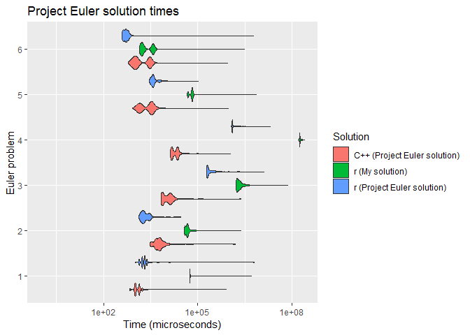

euler
=====

Solutions to [Project Euler](www.projecteuler.net) problems in <code>R</code> and <code>C++</code>.




When coded in <code>R</code>, my solutions to Euler Problems were, on average 32 times slower than the method provided in the Project Euler solutions. Those same solutions were 15 times slower when written in <code>R</code> compared to when written in <code>C++</code>.

``` r
p <- ggplot(data = data_summary, aes(x = as.numeric(problem), y = ratio2)) + 
  geom_point() + geom_line() + scale_y_log10() +
  labs(y = "Ratio (Times slower)", x = "Euler problem",
       title = "Ratio of Project Euler solution time in R compared to C++")
p
```


